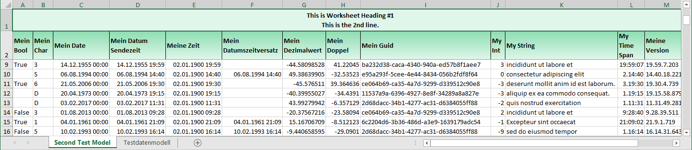
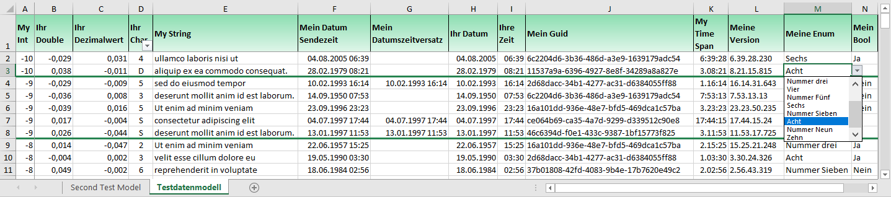

**Purpose**  
A single module that encapsulates all the code necessary to serialize
and deserialize enumerable class objects into Excel and CSV file
formats.

**Nomenclature: Why 'Serialization'?**  
Serialization is the process of converting an object into a stream of
bytes to store the object or transmit it to memory, a database, or a
file. Its main purpose is to save the state of an object in order to be
able to recreate it when needed. The reverse process is called
deserialization.  
See: <https://docs.microsoft.com/en-us/dotnet/csharp/programming-guide/concepts/serialization>

**Features**  

+ Multiple enumerable class objects to/from Excel worksheets or CSV pages.
Class object properties mirror columns.
+ No limits to number of records serialized (records over 1M will overflow into successive worksheets).
+ Performant: 2M records takes 2½ minutes to serialize. Minimal memory footprint.
+ Localization: Automatically translate worksheet tabs, column headings and values into the target language.
+ A single-page CSV format file may easily be imported into Excel with data formatting (partially) intact. Note: In CSV there is no limit
to the number of records, but if upon import into Excel, the number
records exceeds 1 million, Excel import will fail. The up-side is CSV serialization/deserialization is extremely fast.
+ Excel column naming, translating, and formatting is determined by column
descriptors (aka property attributes). Nothing is hard coded into this
module. See attributes XlColumn and XlIgnore.
+ Excel worksheet tab naming and translation is determined by a class
attribute XlSheet.
+ Optional pretranslated worksheet heading. May contain multiple lines.
+ Multiple choice objects such as booleans and enums are handled as translatable dropdowns in the spreadsheet.

**Excel example worksheet with header**

- Column order is implicitly defined by the order of properties in the
  class object.
- A worksheet heading was defined and may contain multiple lines.
- Some but not all the columns were translatable as those headings
  were not in the available in the caller's string resources. It then defaults to the
  class property names.

**Excel example worksheet without header**

- Column auto-fit is determined by the maximum width of any single
  word in the column heading and the maximum width of the data.
- The 'My Bool' and 'My Enum' column data was marked as translatable.
- Multiple choice columns (enum and bool) are restricted to the known possible values.
- The drop down on the first column was enabled by the class property
  column descriptor.
- All data columns were formatted according to the associated class property
  column descriptor.
- The optional divider line is determined by a null class object in
  the enumerable array (see extension SplitBy()).
